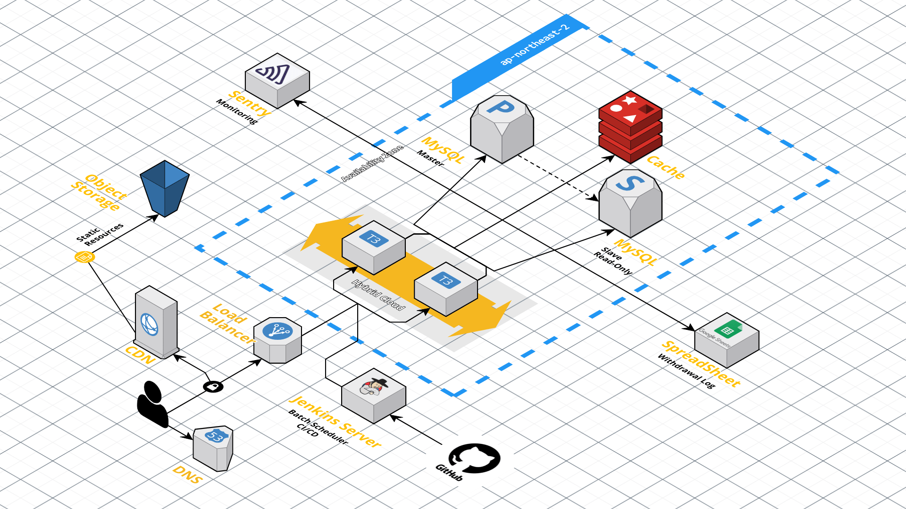
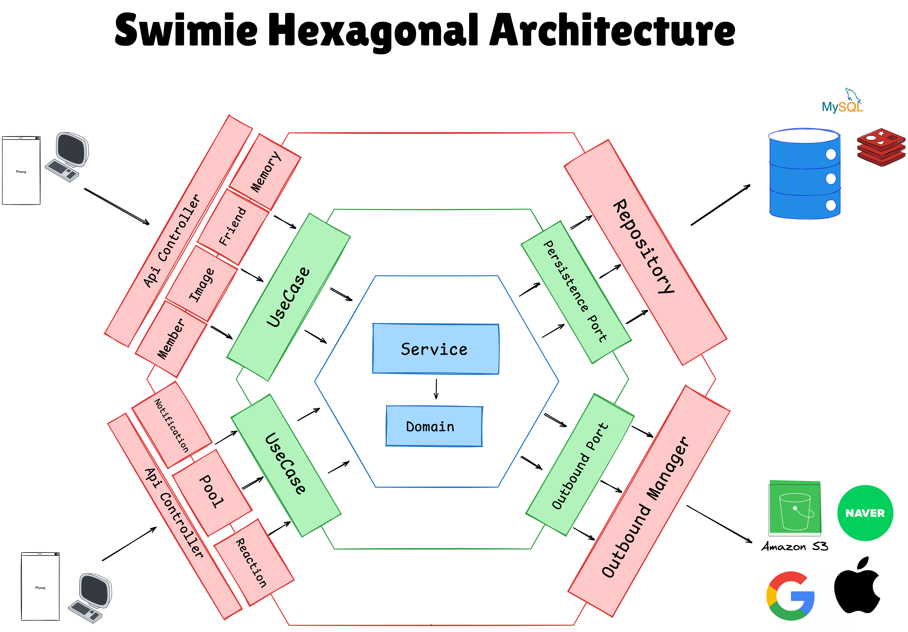
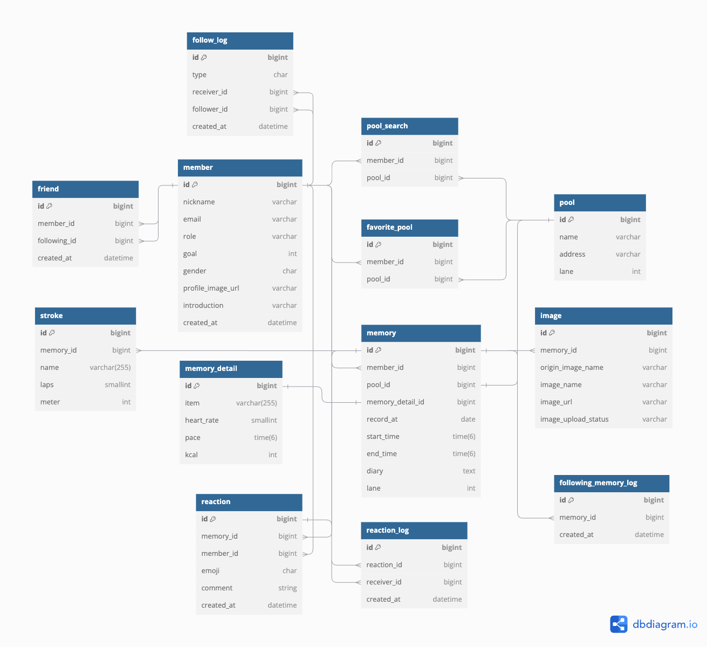

## 🏊 Swimie | 친구들의 응원과 함께하는 수영일기


## 🏗️ Architecture

### Infrastructure


### Software Architecture (Hexagonal)


<br>

## 📂 Module & Directory Structure
### Directory Structure
```
├── .github
├── module-presentation  # API 게이트웨이 서버
├── module-batch  # 배치 서버
├── module-independent  # 독립 모듈
├── module-domain  # 도메인 모듈
├── module-infrastructure  # 외부 모듈
│   └── persistence-database # 데이터베이스 모듈
│   └── persistence-redis # Redis 모듈
│   └── object-storage # 객체 저장소 모듈
│   └── google-spreadsheet # 구글 스프레드시트 모듈
└── docs # 데이터 관리용 폴더
```

### Multi Module Structure
- 멀티 모듈과 헥사고날 아키텍처를 적용하여 모듈 간 의존성을 분리하였습니다.
- Domain 모듈은 순수 자바 모듈로 구성되어 있으며, 외부 의존성을 가지지 않습니다.
- 각 모듈은 Domain 모듈에 대한 의존성을 가지고 있으며, 상위 모듈은 하위 모듈만을 의존하도록 설계하였습니다. 

<br>

## 🚗 How to start?
- presentation 모듈(API 게이트웨이 서버)을 실행하기 위해서는 메인 디렉토리에서 `./gradlew :module-presentation:build` 명령어를 수행합니다.
- `java -jar /module-presentation/build/libs/module-presentation.jar` 명령어를 통해 서버를 실행합니다.

## 💻 Tech Stack
- Java 21
- Gradle 8.8
- MySQL 8.0.35

#### Framework  

#### Database  

#### Auth -   

#### Business Logic Test - 

#### Performance Test -  

#### Cloud -         

#### Monitoring - 
<br>

## 📈 Database Schema


<br>

## Developers
### 🧑‍💻 Server Engineers
|                                                                                                                                                                                                                                              신민철                                                                                                                                                                                                                                               |                                                                                                                                               홍성주                                                                                                                                               |                                                                                                                                               양원채                                                                                                                                               |
|:----------------------------------------------------------------------------------------------------------------------------------------------------------------------------------------------------------------------------------------------------------------------------------------------------------------------------------------------------------------------------------------------------------------------------------------------------------------------------------------------:|:-----------------------------------------------------------------------------------------------------------------------------------------------------------------------------------------------------------------------------------------------------------------------------------------------:|:-----------------------------------------------------------------------------------------------------------------------------------------------------------------------------------------------------------------------------------------------------------------------------------------------:|
| <br/><a href="https://github.com/its-sky" target="_blank"></a> | <br/><a href="https://github.com/penrose15" target="_blank"></a> | <br/><a href="https://github.com/ywonchae1" target="_blank"></a> |

